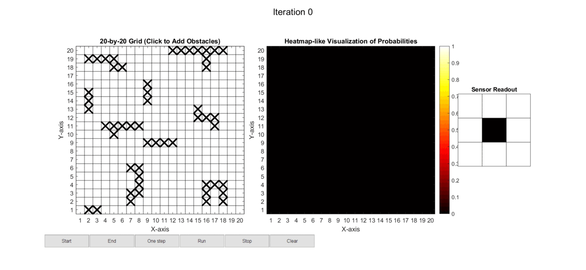

# Estimation and Classification Project

## Description
This project was developed in the context of the Estimation and Classification course and implements self-localization of a robot on a grid map using a Hidden Markov Model (HMM). The HMM is a probabilistic model that allows the robot to estimate its position based on sensor measurements and the previous position.

## Installation
Clone the repository:
```bash
git clone https://github.com/GilSerrano/hmm_localization.git
```

Alternatively, you can download the code as a zipped folder.

## Usage


1. Open the MATLAB editor.
2. Open the `hmm_main.m` file and click on Run or use the Command Line Window and run
    ```bash
    hmm_main()
    ``` 

## Results
Here is an example GIF showing the self-localization process:




## Authors
- Catarina Carvalho
- Gil Serrano